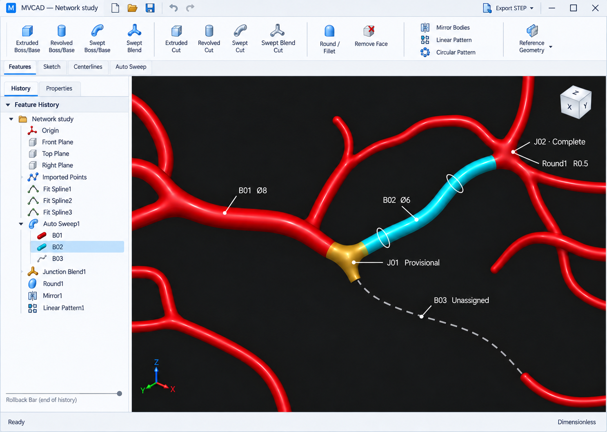

# MVCAD — preferred visual target

Latest revision: [Features view](mvcad-features-v2.png), [Sketch view](mvcad-sketch-v2.png), and [command specification](command-interface-v2.md). These supersede the earlier enlarged toolbar layout while retaining the white theme and vascular workflow.

## Current direction

The user preferred the white interface, requested compact SolidWorks-inspired Features and Sketch tabs and feature history, and added rounding for bifurcations and mergers. Revision 2 uses the supplied toolbar screenshots as visual references and adds the requested additive/cut operations, body mirrors/patterns, reference geometry and sketch mirroring. The current mockups remain available for review.

The original brief called for three independent directions. Two were generated before the user expressed a preference for white. Work then converged on that direction instead of generating the remaining dark Network Studio concept. Its unused prompt is retained for traceability, not as a delivered concept.

This folder contains visual mockups and a behavior brief, not a running CAD application or a validated geometry algorithm. No existing browser application code was reused.

## Artifacts

- [Preferred Features target](mvcad-features-v2.png) and [Sketch target](mvcad-sketch-v2.png).
- [Command specification](command-interface-v2.md): complete requested feature and sketch inventory.
- [Previous Auto Sweep/rounding target](mvcad-white-rounding-target.png): retained operation-state reference.
- [White concept before rounding](concepts/precision-studio.png).
- [Dark comparison concept](concepts/crimson-workbench.png).
- [Exact final refinement prompt](prompts/selected-white-rounding.txt).
- [Generation manifest](generation-manifest.json): prompt and reference lineage.
- `references/`: simulation frames extracted at 2 seconds from mmc2.mp4 and mmc4.mp4 in the supplied background-videos folder.
- `drafts/`: earlier generations, including known inaccuracies corrected in later revisions.

All generation and visual edits used the built-in Image Gen tool. Frames were extracted with FFmpeg. No manual raster repainting was used.

Requested design canvas: 1440 × 1024. Image Gen returned the preferred PNG at **1487 × 1058**; the original raster is preserved without stretching. Treat the mockup as a visual/layout reference, not an exact pixel specification. Implement and verify the eventual Qt layout at 1440 × 1024 and other supported window sizes.

## Visual and interaction direction

Use white/light-gray native controls, compact command tabs, fine separators, a chronological feature history, modest icons and a dark geometry viewport. Crimson vessels, cyan selection and amber provisional blends connect the design to the supplied RBC simulations. Red cells and simulation controls do not belong in the editable model.

The tree exposes reference planes, imported points, fitted curves, sweeps, junction blends and rounding features, with parent/child relationships and a rollback control. Use a single selected-row highlight. Feature names and icon artwork in the mockup are illustrative.

The current screen uses a compact left feature-history dock with operation properties when needed; the viewport occupies the remaining area. Small Features, Sketch, Centerlines and Auto Sweep tabs sit beneath the grouped command strip. Save and Export STEP remain in quick access. See the revision 2 specification for density targets and command grouping.

## Required modeling behavior

### Centerlines and automatic sweeps

- Import image-derived point data, create fitted splines, review connectivity, and split connected centerlines at confirmed connection points into branches. Free endpoints also delimit branches.
- Selecting a branch exposes its dimensionless diameter. The branch interior is a filled circular lumen solid with a constant diameter.
- Reserve space for junction transitions using independently editable start/end setback percentages. Default is 10% at each junction end. Free inlet/outlet endpoints have no setback and extend fully.
- Assigning a neighboring diameter automatically previews its sweep and the connecting transition. Example: B01 diameter 8 and B02 diameter 6.
- At a three-way junction with only two diameters assigned, show a provisional blend and the remaining branch as an unswept centerline. Rebuild the joined region when all incident diameters exist.
- Provisional, complete and failed are distinct states, using explicit text and icons as well as color. A failed rebuild must not be presented as completed geometry.
- The screenshot is illustrative; it does not prove junction topology, surface continuity, solid validity or export validity.

### Rounding

- Add a Round / Fillet modeling command to create smooth transitions at bifurcations and mergers.
- Let the user select a junction, edit a radius, preview the result, and apply it as an editable history feature.
- The preferred mockup previews rounding on completed junction J02 while J01 remains provisional. The displayed radius 0.5 is an example, not a chosen product default or a guaranteed valid radius.
- Rounding refines the junction boundary; it does not replace the joined junction construction or extend diameter variation throughout the constant-diameter branches.
- If a requested radius cannot form valid geometry, report failure and retain the last valid model. Exact continuity targets and geometric strategy remain part of kernel feasibility evaluation.

### General part modeling

- Extruded, revolved and swept boss/base operations and their corresponding cuts; additive Swept Blend and Swept Blend Cut.
- Body mirroring, linear/circular body patterns and reference planes/axes/points/coordinate systems.
- Sketching, constraints/dimensions, basic entities/editing, sketch mirroring and linear/circular sketch patterns; see the revision 2 command inventory.
- Centerline-first sweep and swept-blend workflows, with an automatically offered sketch plane normal to the centerline.
- Remove Face creates an open boundary surface shell while retaining access to the solid version.
- Part documents only; no assemblies. No meshing or simulation execution in this application.

### Save and export

- Native part saving preserves editable model state and feature history.
- STEP export offers explicit solid geometry, surface geometry and centerline targets.
- Values are dimensionless and must be preserved numerically in exports; no implicit scaling based on assumed microns or millimeters.
- Native file extension/schema, point-import formats and STEP representation/unit metadata are not selected by this mockup. Early draft file extensions were generated placeholder text and are not requirements.
- Export and Remove Face dialogs, sketch constraints, and manual sweep plane creation are described here but are not visually verified by this one Auto Sweep screen.

## Architecture constraints retained

- Fresh standalone desktop application in C++ and Qt 6 Widgets, using CMake.
- Windows and macOS from the start; Windows is the primary interactive development environment with MSVC 2022.
- Automated builds and tests for both platforms, with early testing on a real Mac.
- Public GitHub repository and installers distributed through GitHub Releases.
- Geometry kernel undecided; Open CASCADE remains a candidate requiring modeling feasibility evaluation.

## Verification and limits

Visually inspected the generated preferred target: light controls, compact history, readable unclipped main labels, B01 diameter 8, B02 diameter 6, separate 10% setback fields, provisional J01, complete J02, unswept dashed B03, Round / Fillet command, radius input and Round1 feature are visible. The J01 region was corrected to remove an unintended fourth solid branch. No physical-unit suffix appears in the preferred target.

All saved PNGs were opened with Pillow and passed file integrity verification. The actual output dimensions are recorded above. No executable application, interactive control, geometric operation or CAD export was tested because this milestone produces visual targets only.

Revision 2 validation and image-generation limitations are recorded in the command specification. This work has not created or published a repository.
